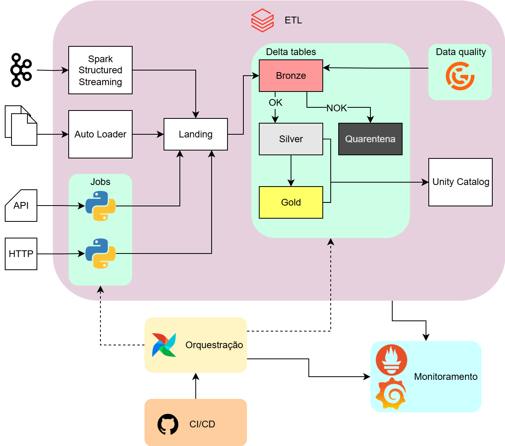
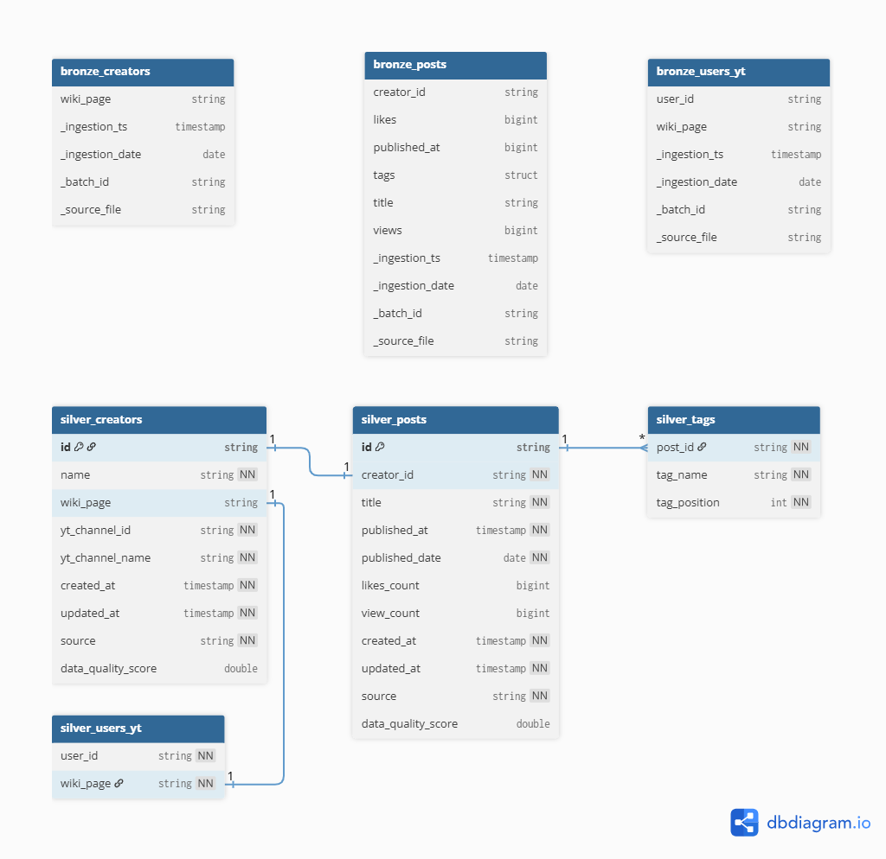

## Pipeline de Dados — Documentação Técnica

> Escopo: este documento descreve arquitetura, padrões de implementação, operação e observabilidade do pipeline abaixo.

### 1. Objetivos e princípios

- Confiabilidade: dado bruto sempre preservado no Bronze; promoção controlada por regras de qualidade.

- Baixo acoplamento: ingestão, qualidade, transformação e consumo evoluem independente.

- Governança: tudo catalogado no Unity Catalog com RBAC, tags e linhagem.

- Observabilidade: métricas de orquestração, engine e qualidade dos dados no mesmo painel.

### 2. Stack técnica

- ETL: Apache Databricks
- Data quality: Great Expectations
- Data catalog: Unity Catalog
- Orquestração: Apache Airflow
- Monitoramento: Prometheus, Grafana
- CI/CD: Github

### 3. Fluxo detalhado

1. Fontes
    - Streaming (Kafka para Structured Streaming)
        - Checkpoints: um diretório por query (`/chk/env/dataset`)
        - DLQ: tópico `dataset.dlq` para mensagens impossíveis de parsear
    - Auto Loader (arquivos)
        - Separar erro de parsing vs. regras: 
            - Erro de parsing vai para `badRecordsPath`
            - Violação de regra definida no data quality vai para quarentena
    - API/Scraping (scripts Python customizados)
        - Resiliência: retry/backoff, 429/Retry-After, circuit breaker

2. Landing
    - Preserva o raw/imutável para auditoria e backfills
        - Conteúdo: arquivos originais (JSON/CSV/Parquet); não particionado por schema.
        - Retenção: 7–30 dias (ou conforme compliance).

3. Camada bronze (Delta Table)
    - Normaliza cabeçalhos/metadata e guarda dados brutos + metadados de origem
        - Conteúdo: tudo que foi parseado de landing + colunas de metadados.
        - Colunas sugeridas:
            - `source_system` 
            - `ingestion_ts` 
            - `batch_id` 
            - `source_file`
        - Particionamento sugerido: `ingestion_date`

4. Data quality
    - Validações: Great Expectations
        - Se OK, segue para camada silver
        - Se NOK, segue para delta table de quarentena
    - Quarentena (Delta - erro tratável)
        - Finalidade: persistir linhas inválidas com motivo e contexto para correção/replay.
        - Colunas sugeridas:
            - `reason` 
            - `rule_id` 
            - `severity`
            - `ingestion_ts`
            - `batch_id`
            - `status` (open, fixed, discarded)
        - Reprocessamento: job lê `status='open'`, corrige e move para camada bronze, marcando `status='fixed'`

5. Camada silver (Delta Table)
    - Tipagem forte, deduplicação, event-time coerente, refinamento

6. Camada gold (Delta Table)
    - Modelagem: star/snowflake
    - Modelos analíticos/BI/serving

7. Data catalog (Unity Catalog)
    - Catálogo lógico: prod|stg|dev → dominio → bronze|silver|gold|ops
    - RBAC: acesso need-to-know; owners e stewards por tabela.
    - Classificação & mascaramento: tags PII/PCI; column/row-level security
    - Linhagem: habilitar lineage no workspace; linkar nas mensagens de alerta
    - Auditoria: consultas e grants versionados

8. Governança, observabilidade (Prometheus/Grafana)
    - Observa a run de maneira completa
        - Airflow: Prometheus exporter (status de DAGs, duração, SLA)
        - Databricks: JMX exporter (latência/batch, throughput)
        - Scripts Python customizados: prometheus_client + Pushgateway.
        - Data quality: quality_metrics (tabela Delta) lida em Grafana

9. Orquestação (Apache Airflow)
    - DAGs para scrips Python na fase de ingestão
        - Agenda execução e força retry quando necessário
    - Engatilha pipeline no Databricks
        - Em DLT direto, executa
        - Sem ser DLT, chama execução de notebooks ou jobs (via operador Databricks)

10. CI/CD (Github)
    - Github Actions para fazer deploy de modelos e scripts
        - Commits em staging
        - Deploy em main

### 4. Modelagem

